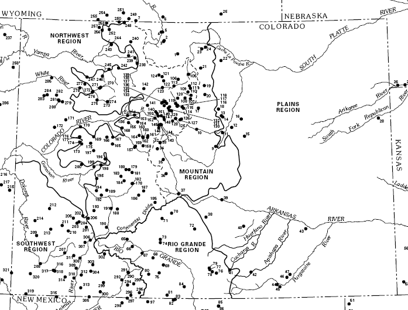
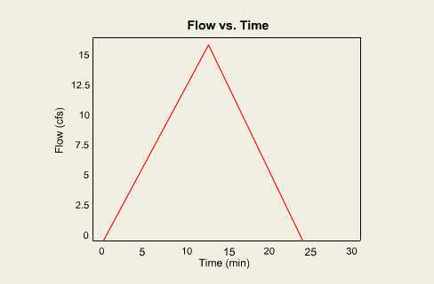
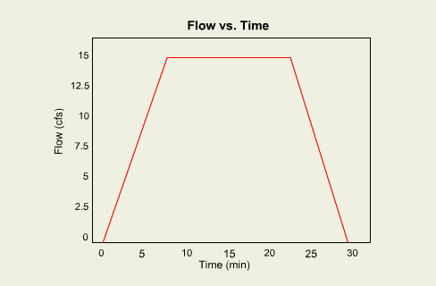

## General Modeling

Estimates of peak flows and runoff volumes (hydrographs) are necessary for the design of a wide variety of hydraulic
structures, including culverts, detention basins, and bridge openings. Such estimates are made by modeling.

In general there are two different classes of models, or ways to estimate peak flows and hydrographs. The first is based
on historical records used in statistical models. In other words we use historical records of stream flows to predict
what might occur in the future. The second class of models are referred to as deterministic models where physical
properties about the watershed and stream are used to numerically simulate peak flows.

## Statistical Models

Because the hydrologic cycle is a complex process that can be difficult to represent with numerical models, past history
is perhaps the best way to predict what might happen in the future. NOAA, USGS, and other government agencies have long
kept records of precipitation and stream flow so for many locations we know what historical peaks, and long term
averages are. However, gaged locations are relatively few compared to the number of ungaged locations for which
estimates must be made. Regression techniques are typically used to relate characteristics of gaged watersheds to
ungaged watersheds so that information collected can be used to predict runoff for a wider area.

## NSS NationalStreamStats

The USGS in cooperation with the FHWA and FEMA have developed state by state regression equations that can be used to
predict peak runoff of ungaged watersheds from the historical records and regression analysis of "hydrologically"
similar gaged watersheds. Hydrologic similarity generally means within the same climate, elevation, and and use region.
Each state is divided into similar regions like the ones shown for Colorado below. Within these regions several gages
where historical flows have been measured (black points in the Colorado map) are used to develop regression equations
based on characteristic watershed and meteorological variables. When a peak flow estimate is desired for an ungaged
drainage, the regression equation is used for the region where the ungaged basin is located.

For example the Colorado equations for the 100 year flood for the different regions are as follows:

Mountain

Q100 = 39.5(A)0.706(S+1.0)1.577 Where A = area, S = slope

Rio Grande

Q100 = 1.19(A)0.846(P)1.074 Where A = area, P = precipitation

Southwest

Q100 = 118.4(A)0.715 Where A = area

Northwest

Q100 = 104.7(A)0.624 Where A = area

Plains Region

Q100 = 1640(A)0.388 Where A = area

It should come as no surprise that all of the equations contain Area as an indicator variable. While the Mountain
equation uses a measure of watershed slope, the Rio Grande uses the mean annual precipitation.

Each state has been similarly divided and using historical information, regression equations for the 2, 5, 10, 25, 50,
100, and in some cases 500 year events have been defined. Two strengths of the regression equations are: 1) the ability
to quickly estimate peak flows from variables typically determined for a watershed study; and 2) They do not rely on
converting rainfall to runoff through numerical methods. The disadvantage is that while equations have been defined for
each state, there is still significant uncertainty in results because of inadequate information. For this reason
regression equations should be used cautiously, and where applicable, compared with results from a deterministic model.

## Deterministic

A deterministic model uses physical characteristics and numerical representations of physical processes like rainfall,
infiltration, runoff, and detention basin and river routing to estimate peak flows. The driving force behind a
deterministic model is the rainfall depth and rate (intensity).

The rational method and HEC-HMS are two common deterministic models that will be used to describe these
processes. Most other numerical models are similar in nature to the methods used by these two.

## Rational Method

The rational formula is one of the oldest and most commonly used methods to predict peak flows. It was originally used
to estimate peak flows only, but a triangular shaped hydrograph has also been used to define the hydrograph shape and
runoff volume. Precipitation is represented through an intensity (inches/hr) and it is assumed that the intensity is the
same throughout the entire watershed. All losses, including initial abstractions, are represented with a single runoff
loss coefficient defined between 0.0 (no runoff) and 1.0 (no losses). The only other input variable is the drainage
area, in acres.

The rational hydrograph is defined as a triangle, with the peak flow occurring at the time of concentration and the
total duration of the storm being two times the time of concentration.

This traditional rational hydrograph assumes that duration of the storm is equal to the time of concentration.  If the duration is longer, the hydrograph shape will change from a triangle to a trapezoid with the corresponding peak flow.

The rational method is simple and easy to use, but the difficulty in determining a runoff coefficient and the limitation of defining rainfall as a constant intensity make it applicable mostly for small, urban watersheds.

## HEC-HMS

The US Army Corps of Engineer's Hydrologic Engineering Center (HEC) has been involved in the development of computer
simulation models for several decades. One of their most popular models has been HEC-HMS, which is a deterministic model
used to model runoff from rainfall. The HEC-HMS (formerly HEC-1) model includes several different methods for defining
rainfall, losses, runoff transformation and routing. HEC-1 is divided into separate hydrograph computational units as
illustrated in the diagram below.

The most simple hydrograph analysis problems are solved with a single basin. For a basin, runoff is computed from a
defined rainfall depth and temporal distribution, a loss coefficient, and a runoff transformation method. The way these
three processes are simulated in a deterministic model will be discussed in the following pages. For more advanced
analyses a computed basin hydrograph can be routed through reaches, reservoirs, and diversions to produce the resulting
downstream hydrograph based on the channel, reservoir, or diversion properties.
