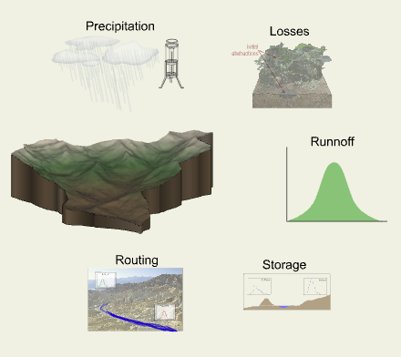

# Simulating the Hydrologic Cycle

While everyone has a basic understanding of the hydrologic cycle, it can be more complex and difficult to accurately
simulate than might be expected. It would be impossible to explicitly represent all of the physical processes that make
up the hydrologic cycle and so a simulation model must make simplifications and represent those aspects which are most
easily measured and incorporated into a numerical model. Further, the driving forces or most influential aspects of the
hydrologic cycle must be present in a model which aims to reproduce numerically what we observe naturally. The diagram
below illustrates the basic processes of precipitation, initial abstraction, losses, runoff transformation, storage, and
routing that are represented in typical numerical models.

The remainder of this lesson provides information about the theories used to represent these basic processes in a simulation model.