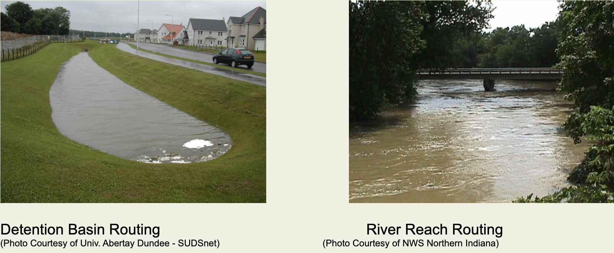

## Routing

When it is necessary to subdivide a watershed in order to design a detention facility, a culvert or other hydraulic
structure, or simply because the parameters of the hydrologic model like rainfall or curve number change in space, then
the runoff hydrograph must be routed in order to account for the effects of travel through the storage basin or river
reach.

There are two types of routing that will be presented in this section. Storage routing through a detention basin, or
behind an embankment where a culvert might be present, and river routing through a natural channel reach.

## Storage

### Storage Routing

Runoff storage occurs in many different ways such as: reservoirs, small basins in developed areas, parking lots in
industrial areas, or where embankments for roads and other structures impede the passage of water. The end result in
each of these cases is the temporary (or in some cases long term) storage of flood waters. Such storage reduces the peak
flow by spreading the runoff out over time. In cases like large reservoirs the runoff may be stored for long periods of
time so that it can be released as a water supply during dry months.

The fundamental mechanism of storage routing is the same for each of these cases and is defined by the equation:

ΔS = Inflow - Outflow

This is illustrated in the following animation. When runoff entering a detention basin, or behind an embankment is
greater than the capacity of a low-level outlet or culvert the excess water is stored. As the storage increases so will
the water surface elevation. Increased water surface elevation produces a greater hydraulic head on the low level outlet
which will increase the outflow, but as the detention basin is filling it is still not at the rate of inflow. Finally,
the water surface elevation may increase to the point that water spills over an emergency spillway or the top of the
embankment as weir flow. As the flood waters recede the outflow will gradually become less than the inflow and the
detention basin will empty.

<video controls style="border: 2px solid black">
  <source src="/static/video/Storage_routing.mp4" type="video/mp4">
</video>

In order to numerically simulate storage in a reservoir relationships between elevation and volume of storage and
elevation and discharge must be defined.

### Storage Capacity Curves

The relationship between elevation and volume of storage is referred to as the storage capacity curve. It is determined
by calculating the volume of water stored for incremental elevations. In reservoir routing the incremental volume of
water between time steps is determined from the input hydrograph, and then from the storage capacity curve a new water
surface elevation is determined.

<video controls style="border: 2px solid black">
  <source src="/static/video/Storage_capacity.mp4" type="video/mp4">
</video>

Surveys conducted at the time of a dam construction are used to develop a storage capacity curve as part of the overall
design. This information is generally available for existing, larger dams. For smaller detention basins geometric
shapes (rectangular dimensions) can be used to estimate the storage capacity curve. Providing digital elevation data are
accurate and current they can be used to estimate elevation - volume relationships.

### Storage Outflow

While the storage capacity curve is used to define the relationship between volume and elevation, a rating curve that
defines the elevation vs. discharge is required in order to determine the outflow from the storage basin. Generally
discharge is controlled by low level outlets and spillways. Culverts and other pipe openings are typically used for low
level outlets. Spillways are part of any dam construction, but in the case of a roadway or other similar embankment that
may cause flood waters to be temporarily stored, the roadway itself acts as a spillway once the water surface elevation
reaches the top.

<video controls style="border: 2px solid black">
  <source src="/static/video/Elevation_Discharge.mp4" type="video/mp4">
</video>

Rating curves for hydraulic control structures like culverts and spillways can be computed from simplified equations
such as the orifice and weir equations. More sophisticated programs such as HY8 or HEC-RAS can also be used to generate
rating curves where inlet and outlet losses and improved structures are considered. Such rating curves can be exported
for use in detention basin analysis.

## River Routing

As a flood hydrograph moves through a river reach the peak flow is both lagged (delayed) and attenuated (decreased). The
amount of lag is determined by the slope and roughness of the channel, which both affect the speed of the flood wave.
The attenuation is determined by how much the water spreads out. For example, if the channel is concrete lined and the
flows remain within the banks then there will be little or no attenuation. On the other hand, if the flood spills out of
the banks onto the floodplain, or is "absorbed" by the channel as bank storage, then the attenuation could be
significant. The following graphics identify how a hydrograph is lagged and/or attenuated under certain conditions.

<video controls style="border: 2px solid black">
  <source src="/static/video/Attenuation_hydrograph.mp4" type="video/mp4">
</video>

In the next graphic the effects of lag and attenuation are shown simultaneously for a flood hydrograph passing through a
natural channel reach. As the flows increase beyond the capacity of the natural channel it spreads out onto the
floodplain. As the inflow recedes the flows in the floodplain move back into the channel. The final effect on the
outflow hydrograph is that it is spread out with a decreased peak and longer base time. The area under each hydrograph
would be the same except for infiltration losses, which for short flooding events are generally small.

<video controls style="border: 2px solid black">
  <source src="/static/video/Attenuation.mp4" type="video/mp4">
</video>
