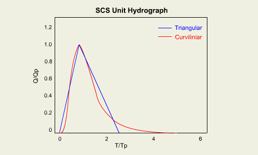

## Basin Runoff

Once losses have been computed the remaining precipitation, referred to as effective precipitation must be converted to
runoff. After the initial abstractions and infiltration capacity are reached the precipitation excess (in this example 1
inch) would be left standing if the watershed were exactly flat. The volume is easily computed as the effective
precipitation depth times the area of the watershed.

However, watersheds are not flat and so the effective precipitation will run off.

## Transformation

Knowing the volume is an important part of hydrology as it helps in designing storage facilities like detention basins.
However, just as important as the volume is the timing of the runoff, including the peak flow, time to peak, and
duration. The transformation of the effective precipitation into a time variation of runoff is described by a
hydrograph.

If the effective precipitation is 1 inch, then the resulting hydrograph is referred to as a unit hydrograph.

## Hydrographs

A hydrograph is described by the following properties:

- Rising Limb - The initial part of the hydrograph where flow increases from the base flow rate towards the peak.
- Peak Flow - The peak flow rate is defined as the maximum flow rate on the hydrograph and will occur when runoff is fully developed.
- Time to Peak - The time from the beginning of runoff to the peak.
- Falling Limb - The recession side of the hydrograph where the flow rate decreases from the peak to the base flow.
- Duration - The hydrograph duration is the time from the beginning of runoff to the end.
- Volume - Volume is represented as the area under the hydrograph.
- Base Flow - The base flow is the part of the hydrograph that represents the normal flow in a perennial stream, or in other words the flow in a river before the rainfall event.

You can move your cursor over words below to better understand these different elements.

### Unit Hydrograph

Most hydrologic models use the unit hydrograph as the basis of converting a computed effective rainfall depth into a
runoff hydrograph. A unit hydrograph is defined by the runoff associated with a unit (1 inch in English units or 1 cm in
Metric units) effective precipitation depth over the entire watershed.

The unit hydrograph is also associated with a time duration, such as 30 minutes, 90 minutes, etc. meaning that the unit
flowrates would be different for different durations of the 1 inch (cm) of effective precipitation.

The unit hydrograph is also affected by the different properties of the watershed such as shape, slope, and land cover.

A unit hydrograph for a basin is derived by measuring the rainfall hyetograph and the runoff at the outlet. The runoff
hydrograph is then normalized by the area of the watershed and rainfall depth, with the duration corresponding to the
rainfall event. The unit hydrograph can be used to estimate the runoff for any event size. For example an effective
precipitation of .5 inches over the duration of the unit hydrograph would result in a total runoff hydrograph where each
ordinate is exactly half of the unit hydrograph ordinate. Likewise a depth of 2 inches over the same duration would
result in a hydrograph that is double the unit hydrograph (move your cursor over the different storm depths to see how
the hydrographs are changed).

### Synthetic Unit Hydrographs

The problem with using a derived unit hydrograph is that if we already have enough measured information (runoff and
rainfall) to derive the unit hydrograph then statistical methods of estimating a peak runoff are likely to be better
anyway. Most often we wish to perform a hydrologic analysis in ungaged locations where it is not possible to derive the
true unit hydrograph. For this reason synthetic unit hydrographs, such as the SCS, Clark, or Snyder, are used in
deterministic models.

A synthetic unit hydrograph is developed based on two important elements; the shape and the time to peak. The most basic
shape is the triangular, rational, unit hydrograph.

In order to make the shape more natural the SCS modified it to look like a typical measured hydrograph by elongating the
falling limb and fitting a higher order shape through the basic triangle.

The Clark method is another commonly used synthetic unit hydrograph. This method uses a time area mass curve to develop
the shape of the watershed. A time area curve defines the percentage of the watershed contributing flow at the outlet
from the beginning of the storm runoff to the time of concentration, or time when the entire watershed is in equilibrium
and contributing to flow at the outlet.

Further it uses a storage coefficient to account for the fact that there is a delayed response to runoff as the
watershed "absorbs" and then "releases" water for runoff much like a sponge. With a storage coefficient the peak can be
reduced by "spreading" or "squeezing" the hydrograph and decreasing or increasing the peak according to the storage
properties of the watershed being modeled. This second degree of freedom in the hydrograph makes it easier to match both
peak and volume of a measured event during calibration.

### Hydrograph Timing

In addition to the basic shape, the time to peak and overall duration are important properties that must be defined when
using a synthetic unit hydrograph. Timing is generally defined using one of two different methods: time of
concentration, or lag time.

The definition of time of concentration is the time of travel for water to flow from the hydraulically most distant
point of the watershed to the outlet.

If a rainfall event lasts at least as long as the time of concentration, then it can be said that the watershed is in
equilibrium at the time of concentration, meaning that a drop of outflow is produced at the watershed outlet for every
drop of rainfall in the watershed. Using an ideal case such as the rational method hydrograph it means that the peak
will occur at the time of concentration and then continue level until the rainfall ceases at which point the watershed
will take the time of concentration for the falling limb to recede back to the base flow.

Of course it is uncommon for the rainfall to continue over the entire watershed at a uniform intensity throughout. The
rational method does not account for variations in soil moisture and hence infiltration which is why the rational method
works better for small urban watersheds. However, these same basic ideas can be applied to other synthetic unit
hydrographs using the time of concentration as a guide in estimating time to peak and duration of the hydrographs.

Another commonly used timing parameter is the lag time. The lag time is theoretically defined as the time lapse between
the center of mass of rainfall and the peak of the hydrograph (actually a point just past the peak, but generally can be
thought of as the peak).

Unfortunately lag time cannot be determined without measured data and so the SCS (who defined lag time in conjunction
with it's synthetic unit hydrograph) developed many empirical equations with gaged watersheds of different
characteristics for use when estimating lag time of ungaged watersheds. They also determined that lag time is
approximately 60% of the time of concentration so that equations used to define time of concentration can also be used
to estimate lag time when necessary.

## Convolution

It has already been stated that a unit hydrograph corresponds to a certain duration. If a unit hydrograph is defined
based on a 30 minute duration, but we wish to model a rainfall event lasting several hours, then we must repeat the use
of the unit hydrograph over many 30 minute durations. An important property of unit hydrographs is that they are linear,
and so we can simply compute the several 30 minute unit hydrographs and add them together, after lagging each
appropriately to account for the proper starting times. The addition of multiple unit hydrographs over the defined
duration to generate the total runoff hydrograph is termed convolution.

As an example suppose we have the following 30-minute unit hydrograph from which we wish to model a storm for which we
have determined excess precipitation over three 30 minute intervals of .15, .8, and .25 inches respectively. We would
first compute each 30-minute runoff hydrograph (15%, 80%, and 25% of the unit hydrograph respectively), and then
starting the first at time 0, the second at 30 minutes, and the third at 60 minutes we would add them together to get
the final runoff hydrograph.

In summary, to compute the runoff of a watershed we follow these steps:

1. Establish the important watershed parameters
2. Define the area of the watershed
3. Compute a runoff coefficient or area-weighted CN
4. Decide a unit hydrograph method and determine the time of concentration or lag time
5. Estimate the rainfall based on an actual event or a design storm
6. The rainfall consists of a depth and a temporal distribution
7. Then for each time step:
8. Determine the initial abstraction. If initial abstraction is not satisfied, go to the next time step
9. Determine the losses due to infiltration
10. Using the unit hydrograph and time of concentration (or lag time), compute the total runoff hydrograph for the time step
11. Using convolution add the hydrographs based on each time step
12. If we are only interested in the runoff of a single basin we are done. However if we wish to examine multiple sub-basins
13. for the purposes of defining a detention basin, some other hydraulic structure, or to take advantage of spatially varying watershed properties
    or rainfall distributions, then we will need to route the computed basin runoff hydrograph and combine them with runoff from other watersheds.
