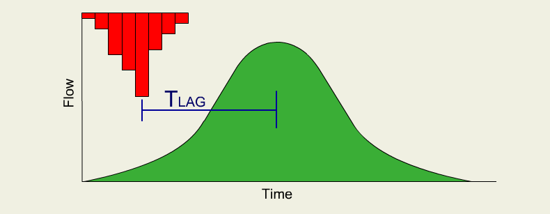
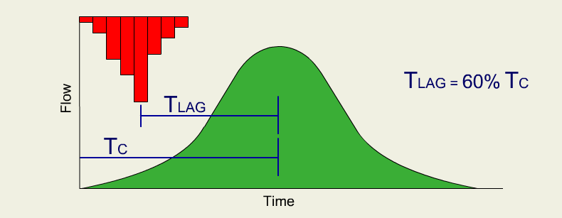

# Hydrograph Timing

In addition to the basic shape, the time to peak and overall duration are important properties that must be defined when
using a synthetic unit hydrograph. Timing is generally defined using one of two different methods: time of
concentration, or lag time.

The definition of time of concentration is the time of travel for water to flow from the hydraulically most distant
point of the watershed to the outlet.

<video controls style="border: 2px solid black">
  <source src="/Media/Videos/Timing.mp4" type="video/mp4">
</video>

If a rainfall event lasts at least as long as the time of concentration, then it can be said that the watershed is in
equilibrium at the time of concentration, meaning that a drop of outflow is produced at the watershed outlet for every
drop of rainfall in the watershed. Using an ideal case such as the rational method hydrograph it means that the peak
will occur at the time of concentration and then continue level until the rainfall ceases at which point the watershed
will take the time of concentration for the falling limb to recede back to the base flow.

<video controls style="border: 2px solid black">
  <source src="/Media/Videos/Timing_extended.mp4" type="video/mp4">
</video>

Of course it is uncommon for the rainfall to continue over the entire watershed at a uniform intensity throughout. The
rational method does not account for variations in soil moisture and hence infiltration which is why the rational method
works better for small urban watersheds. However, these same basic ideas can be applied to other synthetic unit
hydrographs using the time of concentration as a guide in estimating time to peak and duration of the hydrographs.

Another commonly used timing parameter is the lag time. The lag time is theoretically defined as the time lapse between
the center of mass of rainfall and the peak of the hydrograph (actually a point just past the peak, but generally can be
thought of as the peak).

Unfortunately lag time cannot be determined without measured data and so the SCS (who defined lag time in conjunction
with it's synthetic unit hydrograph) developed many empirical equations with gaged watersheds of different
characteristics for use when estimating lag time of ungaged watersheds. They also determined that lag time is
approximately 60% of the time of concentration so that equations used to define time of concentration can also be used
to estimate lag time when necessary.

